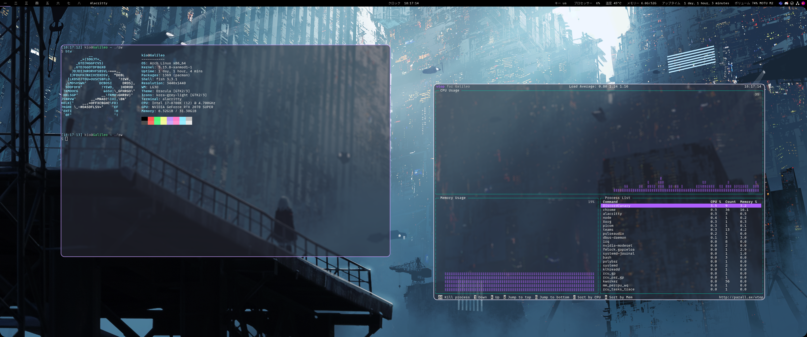
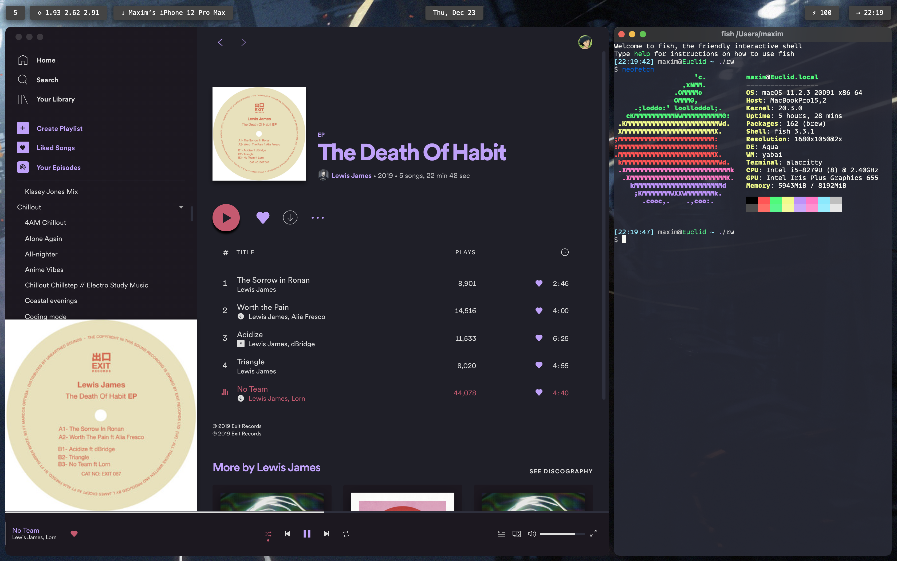

  <h1>Dotfiles</h1>
  
Dotfiles are hidden files prefaced by '.' and used in personalizing your system and programs; here are mine :)

  
•&nbsp;<a href="#my-linux-config">Linux</a>&nbsp; •&nbsp;<a href="#my-macos-config">MacOS</a> •&nbsp;<a href="#installation">Install/Clone</a>

 
<h2 align="center">My Linux config</h2>

</img>[^1]

I'm currently using Arch Linux as my main distro, with xorg + bspwm + sxhkd as my main interface. In the future I plan to check out some alternatives, namely other Arch-based distros and possibly FreeBSD.

### What's included here
- [DE config](#de-config)
- [System files](#system-files)
- [Scripts](#scripts)
- [Themes](#themes)
- [Program configs](#program-configs)
- [Packages](#packages)

### DE config
Instead of a desktop environment I use a tiling wm, hotkey daemon, and status bar. This way there's less bloat and things are easier to tinker with. 

#### ⇒ [bspwm](https://github.com/baskerville/bspwm)
My current window manager is bspwm; I've tried others such as [Hypr](https://github.com/vaxerski/Hypr) but have found bspwm to be the most stable, supported, and open to configuration.

#### ⇒ [sxhkd](https://github.com/baskerville/sxhkd)
My hotkey daemon is sxhkd, although there are many others to choose from.

#### ⇒ [alacritty](https://github.com/alacritty/alacritty)
Alacritty is my favourite terminal emulator; I use it for its simplicity and how well it works under bspwm (not having an ugly title bar / status bar, for one). It's also the terminal emulator I use on MacOS, for the same reasons.

#### ⇒ [polybar](https://github.com/polybar/polybar)
For my status bar / virtual desktop switcher I use Polybar along with some scripts I've written for it.

#### ⇒ [nitrogen](https://github.com/l3ib/nitrogen)
I use Nitrogen to set my desktop wallpaper in Xorg. It's lightweight and doesn't need any configuration.

### [System files](https://github.com/kiosion/dotfiles/blob/master/.arch/)
Included are also various system files for my pc - Stuff like my GRUB config, tweaks to systemd processes, and fstab.

### [Scripts](https://github.com/kiosion/dotfiles/blob/master/scripts/)
I've also included some basic scripts / helpers I've written.

#### ⇒ [backup](https://github.com/kiosion/dotfiles/blob/master/scripts/backup)
This is a script I wrote to automate backing up my home directory, compressing it to a tarball using gzip, then moving it to my archival server using rsync. It uses pv in order to display a progress bar throughout this.

#### ⇒ [logout](https://github.com/kiosion/dotfiles/blob/master/.arch/usr/bin/logout)
A super-simple script that just kills Xorg and some other processes in order to exit to the TTY, assuming you created your session using Xinit.

### Themes
My themes for Polybar, bspwm, and other UI stuff.

### [Program configs](https://github.com/kiosion/dotfiles/blob/master/.config/)
Along with all that, there's config files for a bunch of programs I use regularly - Stuff like VSC, Chrome, Nemo, Discord, etc.

### [Packages](https://github.com/kiosion/dotfiles/blob/master/.pkgs/paru/)
Mostly for my own convienence, but I've also included a complete list of every package and program installed using Paru on my system. This makes full system restores super easy, go ahead and take a peek if you want :)

 
<h2 align="center">My MacOS config</h2>

</img>[^1]

For MacOS, I currently use a tiling window manager plus hotkey daemon. Not much else I can tweak easily within Apple's walled garden :(

### What's included here
- [WM config](#wm-config)
- [Program configs](#program-configs-1)
- [Packages](#packages-1)

### WM config
On MacOS, I use the default desktop environment, however have some additional programs/tweaks to make it slightly more linux-like.

#### ⇒ [yabai](https://github.com/koekeishiya/yabai)
Yabai is the tiling window manager I use on MacOS. My current config makes it close enough to bspwm that I don't notice much difference switching between the two, besides speed.

#### ⇒ [skhd](https://github.com/koekeishiya/skhd)
Shkd is my favourite MacOS hotkey daemon, and is the one I've been using the longest.

#### ⇒ [ubersicht](http://tracesof.net/uebersicht/)
I use Ubersicht as my polybar-stand-in on MacOS. Not quite as powerful, but it's still better (I think) than the stock Apple menubar, and looks nicer too :)

### [Program configs](https://github.com/kiosion/dotfiles/blob/master/.macos/.config/)
I've also included some various configs / install scripts for programs and utilities I use on MacOS.

### [Packages](https://github.com/kiosion/dotfiles/blob/master/.pkgs/brew/)
Like with my linux dotfilse, I've also included a full list of every formulae and cask installed with Brew.

 
<h2 align="center">Installation</h2>

The install scripts included in each OS dir are intended for my devices and *will* overwrite files as well as implement system-specific configurations. *If there are pieces of my configs you like, clone the repo and manually move files into place.*

Run: `git clone git@github.com:kiosion/dotfiles.git kio-dotfiles/`

[^1]: Wallpapers created by [Astero](https://www.artstation.com/pranetoid).
