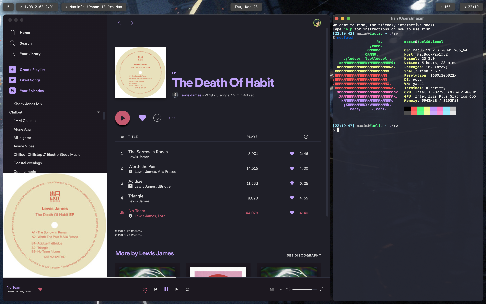

## Dotfiles

Dotfiles are hidden files prefaced by '.' and used in personalizing your system and programs; here are mine :)

## What's inside (Linux)

</img>[^1]

- [DE config](#de-config)
- [System files](#system-files)
- [Scripts](#scripts)
- [Themes](#themes)
- [Program configs](#program-configs)

### DE config
Instead of a desktop environment, I just use a tiling WM, hotkey daemon, and status bar. This way, there's less bloat and things are easier to tinker with :) 

#### [bspwm](https://github.com/baskerville/bspwm)
My current window manager is bspwm; I've tried others such as [Hypr](https://github.com/vaxerski/Hypr), but I've found bspwm to be the most stable and open to configuration.

#### [sxhkd](https://github.com/baskerville/sxhkd)
My hotkey daemon of choice is sxhkd, although there are many others.

#### [alacritty](https://github.com/alacritty/alacritty)
Alacritty is my favourite terminal emulator; I use it for its simplicity and how well it works under bspwm (not having an ugly title bar / status bar, for one).

#### [polybar](https://github.com/polybar/polybar)
For my status bar / virtual desktop switcher I use Polybar along with some scripts I've written for it.

#### [nitrogen](https://github.com/l3ib/nitrogen)
I use Nitrogen to set my desktop wallpaper in Xorg

### System files
Included here are also various system files for my pc - Stuff like my GRUB config, tweaks to systemd processes, and fstab.

### Scripts
I've also included a bunch of quality-of-life scripts / helpers I've written. Things like a volume widget for [Polybar](https://github.com/polybar/polybar), a logout script for when using Xorg without a greeter, and bash scripts to automate system backups and restores.

### Themes
My themes for Polybar, bspwm, and other UI stuff.

### Program configs
Along with all that, there's config files for a bunch of programs I use regularly - Stuff like my VSC dotfiles, Chrome flags and theme, and Nemo configuration.

## What's inside (MacOS)

</img>

- [WM config](#wm-config)
- [Scripts](#mac-scripts)
- [Program configs](#mac-program-configs)

Still #TODO :)

## Installation

The install script included is intended for my pc and *will* overwrite files as well as implement my grub and fstab configs. If there are bits of my config you like, clone the repo and manually move files, instead of using the install script.

[^1]: Wallpapers by the talented [Astero](https://www.artstation.com/pranetoid).
